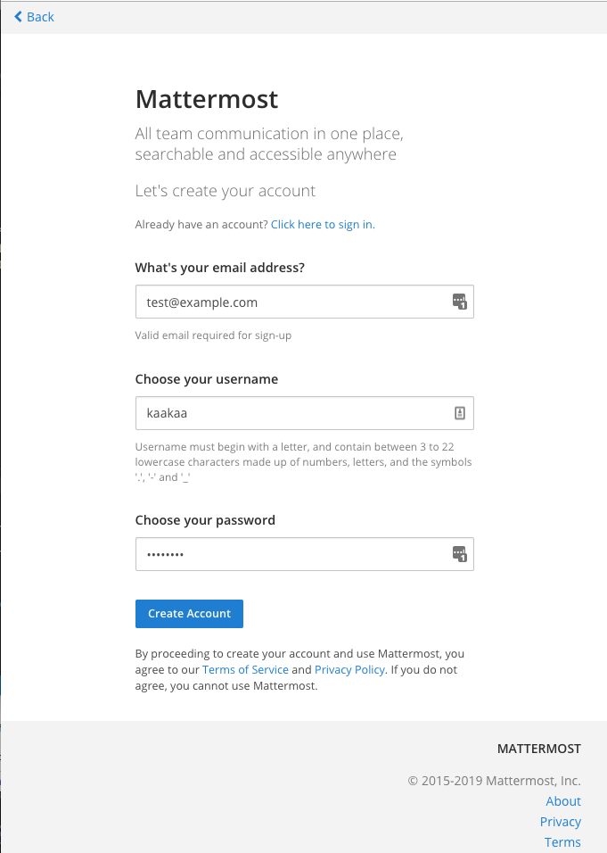
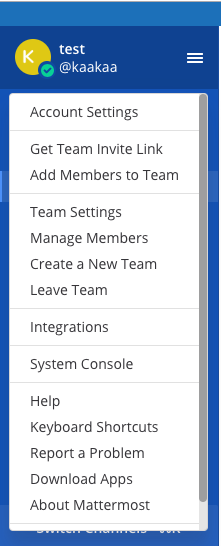
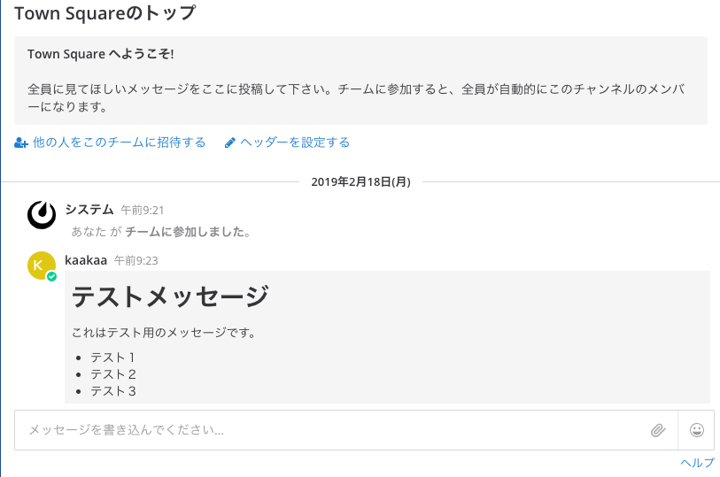

### Mattermostを触ってみる

ここでは、Mattermostのプレビュー用Dockerイメージである`mattermost/mattermost-preview`を使って、Mattermostを動かしてみます。
このプレビュー版Dockerイメージは、パスワードが書かれたDockerfileがGitHub上に公開されていたり、アップグレードが完全にはサポートされていないため、プロダクション環境では使用しないよう注意が必要です。[^1]
Dockerを使ったプロダクション環境へのセットアップを行いたい場合、コミュニティメンバが開発を行っているDocker Compose版の利用が推奨されています。[^2]

[^1]: https://docs.mattermost.com/install/docker-local-machine.html
[^2]: https://github.com/mattermost/mattermost-docker

#### Dockerプレビュー版のセットアップ

Dockerプレビュー版を使用するにはDockerがインストールされた環境が必要です。[^3]
Dockerがインストールされた環境で下記コマンドを実行するだけで、プレビュー版のMattermostが起動します。

```
docker run --name mattermost-preview -d --publish 8065:8065 mattermost/mattermost-preview
```

コマンドが成功したら、ブラウザからコマンドを実行したサーバーの8065版ポートへアクセスすると、Mattermostの初期設定画面が表示されるはずです。
起動が完了するまで数分かかることもあるため、アクセスできない場合は時間が経ってから再度アクセスしてみてください。

[^3]: https://docs.docker.com/install/

#### 初期設定



初期設定画面では、管理者のメールアドレス、ユーザー名、パスワードを入力し、`Create Account`ボタンを押します。


すると、アカウントが作成され、チーム選択画面が表示されます。まだチームを作成していないため、`Create a new team`からチームを作成する必要があります。


チーム作成画面ではチーム名を入力し、`Next`ボタンを押します。
チーム名には英語だけでなく、日本語などの２バイト文字も指定することができます。


次にチームURLを指定し、`Finish`ボタンを押します。
すると、指定された名前とURLでチームが作成され、チャット画面が表示されます。
最初にチームに加入した際はMattermostのチュートリアルが表示されるため、内容を確認しておきましょう。


上記の設定は全て英語の画面で行ってきましたが、英語のメニューに抵抗がある場合は、表示言語を日本語に変更しましょう。
表示言語を変更するには、まず、チャット画面左上のメインメニューから`Account Settings`からアカウント設定画面を開きます。



アカウント設定画面が開いたら、左サイドバーの`Display`メニューを開き、一番下にある`Language`メニューから表示言語を選択します。
デフォルトでは`English`となっているため、この部分で`日本語`を選択し、`Save`ボタンを押すことで表示言語を日本語に変更することができます。


プレビュー版では、アカウントが作成された時点での表示言語はデフォルトで`English`に設定されますが、このデフォルトの表示言語を変更することもできます。

デフォルトの表示言語の設定変更は、チャット画面左上のメインメニューから`System Console`をクリックしてシステムコンソール画面を開き、左サイドバー`Localization`の設定から行います。
システムコンソールへアクセスするには管理者権限が必要です。


日本語で使用するユーザーが多い場合は、チームメイトのユーザーアカウントを作成する前に、この設定を変更しておくと便利です。


// TODO: サイトURL設定？

#### 投稿

以上より、Mattermostでチャットを行う準備ができました。
早速、チャットでメッセージを送ってみましょう。

チュートリアルまで完了している場合、画面中央下あたりに下記のようなチャット画面が表示されているはずです。



`メッセージを書き込んでください...`とある入力ボックスにメッセージを入力し、`Enter`を押すとメッセージを投稿することができます。

MattermostではMarkdown形式でのメッセージのデコレーションや、絵文字の入力、Latex形式での数式入力など、様々なメッセージ方式をサポートしています。
メッセージ入力ボックスの右下あたりに表示されている`ヘルプ`のリンクから、利用できるメッセージの形式についての説明をみることができます。この説明は全て日本語に翻訳されていますので、是非参照してみてください。

#### メンバーの招待

チームに他のメンバーを招待してみましょう。
メンバーを招待するには３つの方法があります。

* 招待メールを送信する
* 招待リンクを作成し、招待したいメンバーにリンクを開いてもらう
* ログイン画面からアカウントを作成する

ここでは、プレビュー版Mattermostで設定変更なく利用できる招待リンクによるメンバーの招待を紹介します。

招待リンクはチャット画面左上のメインメニューから`チーム招待リンクを入手`を開くだけで入手できます。入手したチーム招待リンクを招待したいメンバーに共有し、リンクを開いてもらうだけでアカウント作成画面を開くことができます。

ちなみに、招待メールを送信するにはシステムコンソールからメールサーバーの設定が、ログイン画面からアカウント作成可能とするにはシステムコンソールの`セキュリティー` > `利用登録`から`オープンサーバーを有効にする`を有効にする必要があります。

#### チャンネルの作成

Mattermostではチームを作成した時点で、`Town Square`と`Off-Topic`という名前のチャンネルがデフォルトで作成されます。この二つのチャンネルは、チームに参加するメンバー全員が自動で参加するチャンネルとなります。(`Off-Topic`チャンネルは脱退可能)

新たにチャンネルを作成する場合は、左サイドバーの`公開チャンネル`のテキストの横にある`+`ボタンをクリックすることで、チャンネル作成画面を開くことができます。


チャンネル作成画面では、チャンネル名とチャンネルの`目的`、`ヘッダー`を入力することができます。
チャンネル名には日本語などの２バイト文字も使用することができます。（チーム名の場合と同じく、チャンネル名を２バイト文字のみとした場合、URL文字列を別途指定する必要があります）

ここで、チャンネルの`目的`は他のユーザーがチャンネルに参加する際に見るチャンネルの簡単な説明として使用されます。
チャンネルの`ヘッダー`は、チャンネルの上部に常に表示されている文字列です。ここでもMarkdown形式のメッセージが使用できるため、チャンネルに関連するリンクや開発に関するチャンネルならばTravisCIやCodecovのようなサービスのバッジを表示することができます。下記の画面は、MattermostのDeveloperチャンネルのヘッダーです。


以上の情報を入力し、`新しいチャンネルを作成する`ボタンを押すことでチャンネルを作成することができます。
チャンネルに他のメンバーを追加するには、チャンネル上部にあるチャンネルメニューの`メンバーを追加する`からメンバーを追加することができます。


* * *

私の周りでは、メンバーそれぞれが自由に呟くための個人チャンネルを作成することが多いです。仕事のことだけでなく、技術情報や事務手続き、またはプライベートのことまで自由に発言し、興味のある人が食いついて発言が積み重なることで様々な知識や認識を共有できるというメリットがあります。

2015年に@suinさんが書かれた`Slackで簡単に「日報」ならぬ「分報」をチームで実現する3ステップ〜Problemが10分で解決するチャットを作ろう`[^4]というエントリに近い運用です。

チャットによりスムーズなコミュニケーションが取れるようになること以上に、このように対面だと話す意味がないようなことでも気軽に呟け、共通認識が取れるようになることがチャットの大きな利点だと思っています。

[^4]: http://c16e.com/1511101558/