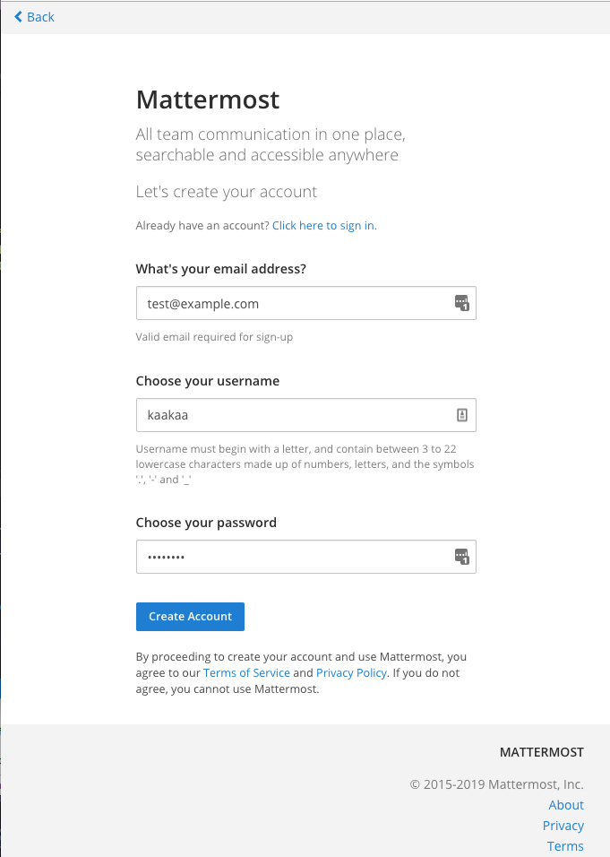
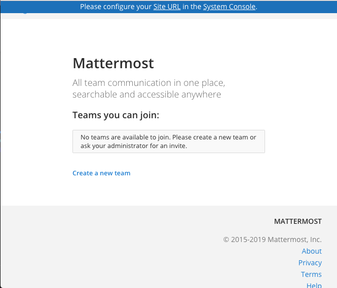
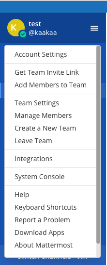
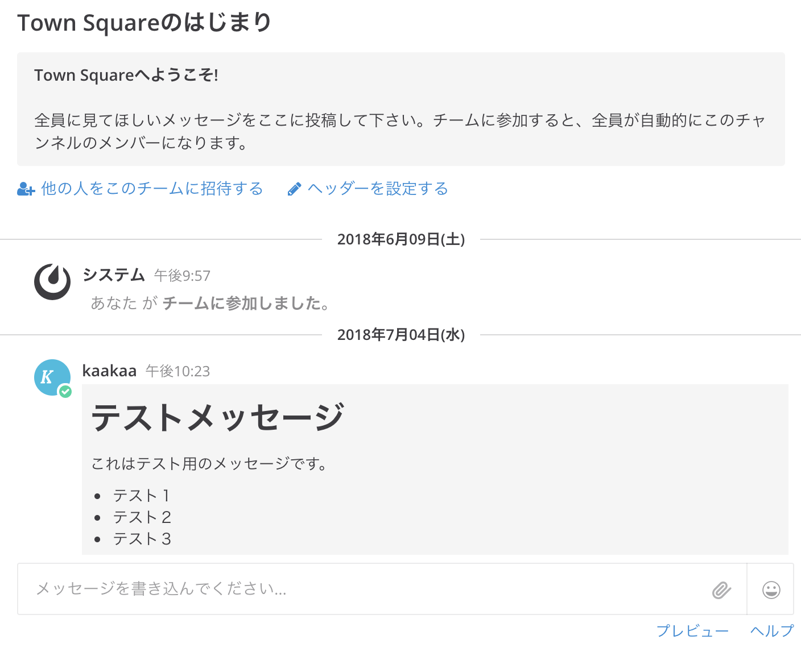
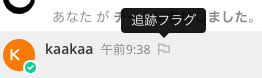
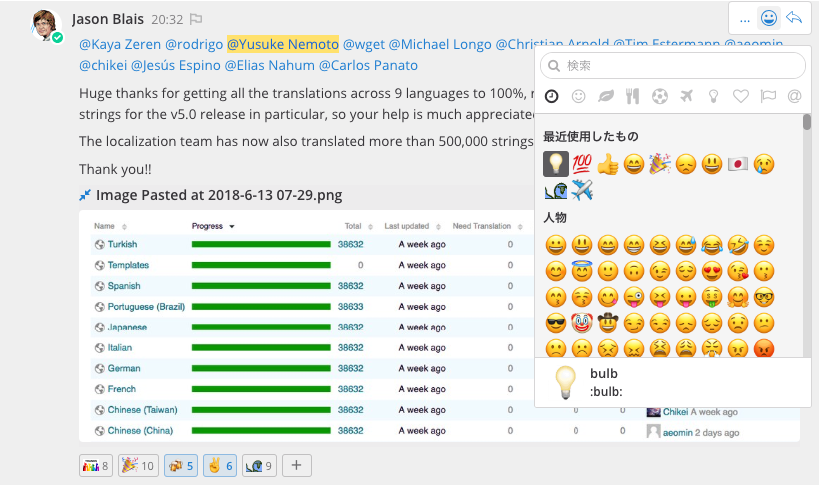

# はじめに

こんにちは！Chat使っていますか？

Slackを代表に、近年ビジネスチャットが流行しています。
この記事は、いわゆる伝統的なSIerの組織でChat(Mattermost)を導入した話です。
Chatは皆がうまく利用できると、とても良いものですが、障壁もそれなりにあります。
私たちが直面した問題や、それに対する工夫などを率直にお伝えできればと思います。

まず、私達のchat利用度合いですが、利用開始から1年程度で大体以下のようになっています。

総アクティブユーザー 300
総チャンネル数 300
総投稿数 350000
日時平均投稿数 1500 - 2000
日次アクティブユーザー 150
月次アクティブユーザー 200
(表にする)

chatは複数の部署（それぞれ複数プロジェクトを持っている）が同居しており
緩い横のつながりで情報共有・交換が日常的に行われています。
特に開発チーム/拡販チーム/保守サポートチームといったチーム間の連携は
chatを利用前と比べて段違いのものになり、仕事のインフラとして必要不可欠です。

## 実践編

さて、それではそろそろ本題に入ります。
私たちのchat利用には、3つのポイントがあります。

それは
 - とにかくオープンに
 - 非同期をうまく使う
 - フラットに、明解に
ということです。

### とにかくオープンに

chat開始時から決めていた一番大きい規約の一つは
” チャンネルはpublicのみを許容し、privateチャンネルは禁止”
でした。

[[絵が欲しい.クローズよりオープンがいいよ、って感じの]]

chatを利用する前はメールやwikiなどを利用していましたが
ほとんどの情報共有はチーム内に閉じており、そのやり方もプロジェクトごとにバラバラでした。
そのため、当初このルールに対して否定的が意見が多数ありました
「全員に見えている状態では会話しづらい」
「クローズドとオープンと両方あればいいのではないか」
「セキュリティ上問題があるのではないか」
「情報が多すぎるとかえって混乱する」    
組織メンバの大部分はオープンなやり取りに慣れていないため、違和感があったり拒否感がある人が多かったのです。

しかし私は、仕事の情報を誰もが簡単に閲覧できることで生産性が上がると考えており、そういった組織文化を作りたかったのです。

そこで、私はメンバのうち情報発信が得意だったり、皆から信頼されている人を巻き込んだ利用を進めることにしました。そういう人たちに「なるべくこまめに情報発信をすること」「誰かが何か書いたら、何かしらの反応をすること」といったことを繰り返し伝えてchatの活性度を高めました。

当初こそ批判があったものの、このルールで運用を始め利用していくうちに
情報をオープンにすることによる効率化が少しずつ見えはじめ、組織に定着していきました。

例えば、それまで組織間のやりとりは、簡単なことでも資料を作成し打ち合わせを調整して話を進めていましたが、資料など作らずchatで気軽に会話するケースも増えました。

従来、なぜ簡単な話でも資料を作っていたかを考えると、対面する相手に提供する情報がその後どう利用されるかわからず、問題を起こさないようにするためでした。
これに対し、オープンな場所での会話は、何かあってもそこで話ができるし、自チームの他者も見てくれているという感覚があり、気軽に組織を超えての連携ができるようになりました。

また、ちょっと副次的な効果として、このオープンという特性は
chatを「遊んでいる」と考えている人に対しての反論にもなりました。
すべての会話がオープンなので、遊んでいても丸見えです。
chatを遊びと見なすのは隠れてこそこそしているイメージがあったようです。

### 非同期をうまく使う

chatが多少組織に浸透したころ、古参の社員から
「chatに書いたからといってそれを正式な通達としないでくれ」
とクレームがありました。

[[絵が欲しい。かたい人がchatに文句言ってる感じの。]]

当時、chatのチャンネル数も増え、発言も活性化してきていたため
毎日投稿されるテキストは相当なもので、どこまで何をだれが読んでいるか
むしろ自分がどれだけ読んでいるかわからないこともあり
今までのメールと同様の扱いをしてしまうことは危険でした。

このとき決めたルールは簡単なもので
「chatで発言しても、反応(コメントor絵文字リアクション)がない限りは読まれていないものとする」
でした。

このシンプルなルールだけで問題なく運用できるようになりました。
相手がいつ読むかわからず、読んでもらえたことは投稿者が確認する、こうしたことで
情報をうまく投げっぱなしにすることができています。

ルールが定着したことで、一番変化があったのは「打ち合わせ」でした。
それまで、会議室で話すことが重要という文化だったため時間効率が悪く、また会議が多すぎるため会議室の予約ができないこともよくありました。
非同期で問題ない会話をchatで済ませることで会議が減り、働きやすくなりました。

少し話がそれますが、対面での打ち合わせは実施するだけで達成感を覚えたりします。
井戸端会議が楽しいのと同じように、人とのおしゃべりは楽しく、その楽しい時間に価値があると錯覚します。
多くの組織で会議が大量に実施されている理由かもしれません。


### フラットに、明解に

chatは文字列のみのやりとりであるため、ハイコンテキストなやり取りが難しいですが、それにはメリットもあります。
対面でのコミュニケーションはその場の空気や振る舞いにより言葉以上のものを伝えることが出来ます。
これは、交渉や説得において有効に使えますが、純粋な議論では逆に働いてしまうこともあります。
声の大きい人や、職制の力が方向性を決めてしまうことはよくあるでしょう。

私のチームには内向的なメンバーが数名いましたが、それぞれ考えを持っていてもあまり打ち合わせの場所で主張することが少なかったです。それがchatを利用することで、誰かに対して主張するという形から、ただ自分の意見を述べる形になったことで意見を出してくれるようになりました。

また、文字列にするということも重要なことです。
口頭での議論は、場の空気でなんとなく上手くいっているように思えても
後から振り返ったときにあまり有益な議論になっていなかったということもあります。
明文化することで、ロジックをきちんと組み立てるようになります。

ただし「chatに書くのは面倒。口頭で話をしたほうが早い」という人もいます。

会話したほうが早くて簡単なのはその通りです。
ただ、会話内容を残したかったり、多数の人に伝えたほうが良かったりする場合は
chatに書いてもらったほうが便利です。

私たちがchatを利用するようになってから、会話をしている最中に
「ここで会話するより、chatで会話したほうがみんなに伝えやすくていいから
chatにしよう」という話をすることも出てきました。

慣れないうちは時間がかかることもありますが、日常的に文字列でやり取りしていると
物事を認識したり表現する能力や、その実行速度も向上していきます。

## 課題と工夫

これまでchatの良さについてだけ書いてきましたが、実際に導入して
上手くいくようになるまでには壁もありました。

まず、chat導入で一番最初に問題になることは「書いてくれない」「読んでくれない」ことでしょう。

私がやっている主な対策は以下のようなものです。
- 基本的な規約の提示（publicにすること、チャンネル作成の基本ルールなど）
- 自分が率先して書く
- メールを使わない。メールに「chatに書きました(URL)」と書く。
- 何か書いてくれたら必ず反応する（コメント/絵文字リアクション）
- chatを使うことの啓蒙活動

環境を作れば勝手に盛り上がることはなく、こうやればうまくいくという方法はわかりません。
推進者が率先して利用して、利用者が「chat使うと便利だな」と思ってくれるまで
しつこくやり続けることが正攻法です。

また、私が啓蒙活動として、繰り返し言い続けてる言葉をいくつかを記載すると
「自分が当たり前とか価値が無いと思うことでも、他の人にとっては役に立つことはたくさんある。
自重せずになるべく書くようにしよう」
「何かを書いたとき、ちょっとしたことでも反応をもらえると嬉しいでしょ？
ちょっとでも何か感じたらコメントしたり、絵文字押したりしましょう」
「チャット全部を読む必要はないけれど、メンションされたものだけは読むようにしましょう」
こういったことを、オンライン・オフライン問わず地道に伝え続けています。

険しい道のりですが、chat文化が根付いた組織はとても良いものです。
ぜひ、素敵なchatライフを！

---

# Mattermostについて
本誌を読んでいるエンジニアの方々なら、チャットツールを日常的に使用しているのではないでしょうか？
メールよりカジュアルにコミュニケーションを取ることができるチャットツールは、瞬く間にエンジニアのコミュニケーション基盤として定着しました。

チャット基盤として最も良く使われているのはSlackだと思います。
SaaSとして提供されているSlackは、自分たちでサーバーを用意したりする必要はなく、利用登録をするだけで無料ですぐに利用することができます。

このようなSaaSとして提供されるのチャット基盤は、手軽に利用できることがウリですが、コミュニケーションの履歴を外部サービスに預けることになるため、所属する組織によってはコンプライアンス上の問題により利用が禁止される場合があります。またサービス利用元の制限だけでなく、Slackでは16歳未満のユーザーはサービスへのアクセス自体が禁止されているなど、サービス提供元の利用規約に抵触する状況でチャットを利用したい場合なども別の選択肢を選ぶ必要が出てきます。

このような状況でもチャットを利用したい場合の選択肢として、オンプレミス環境に手軽に構築可能なOSSのチャットツールが存在します。
OSSのチャットツールを利用することで、サーバー管理やバージョンアップ等のメンテナンスに関わる人的コストは必要となりますが、自分たちで決めたルールで運用することができ、チャットデータを完全に自分たちで管理することができるようになります。また、OSSなので機能的に不足がある場合には自分たちで実装することもできます。

以下の条件に当てはまる場合は、OSSのチャットツールが選択肢に挙がると思います。

* 所属する組織のコンプライアンスに抵触する
* チャット上のデータを自由に活用したい
* 社内サービスとチャットを連携させたい

## OSSチャットツール

OSSのチャットツールにもGitHubで数千〜数万のスターを獲得しているものがいくつもあります。今回紹介するMattermostの他にもRocket.chatや一時期Dropboxに買収されていたZulipなどが有名です。Slack Alternativeをコンセプトとし互換性を意識するMattermostと最も機能数が多くGitHubでのスター数・Fork数も多いRocket.chat、スレッドベースのチャットという強烈な個性を持つZulipと、それぞれに特徴を持つチャットツールですが、基本的な機能としては大きく相違は無いと思っています。

* Dockerイメージによる環境構築
* ReactNative製のスマホアプリ(Rocket.chatはKotlin/Swiftアプリ有り)
* Electron製のデスクトップアプリ
* 非公開チャンネルや1on1のプライベートメッセージ
* APIやウェブフックによる独自連携機能作成
* プラグイン/Appsによる拡張ポイント

などの機能は上に挙げた全てのチャットツールが持つ機能です。今後もOSSとして開発されている以上、他のチャットツールに実装された便利な機能はユーザーからも要望されるため、あまり機能差は生まれていかないと思います。

そんな中で私がMattermostを選択する理由としては、その堅実なプロジェクトマネジメントにあります。
Mattermost以外のリポジトリでは数千個のIssueや数百個のPullRequestsがOpenのままになっています。IssueやPull Requestが多いことは、開発が活発に行われていることを示すバロメーターでもあるため良いことではあるのですが、1年以上も手をつけられていないものまでOpenにし続ける意味は無いように思います。
それに対し、Mattermostは一定期間反応がないIssueやPullRequestsはJIRA移しているため、Openなものは常時100~200程度のIssueと数十個のPull Requestsに収まっています。結局OpenなIssueがJIRAに移っているだけにも見えますが、新しいコントリビューターにとっては貢献するIssueを見つけやすい方が良いはずです。
また、機能要望についても独自のフォーラムで投票を受け付けており、投票数が多いもから機能追加に着手するなど透明性も保たれています。

私自身、OSSにコントリビュートして技術力を高めたいという想いを持っているため、堅実にプロジェクトマネジメントを行なっているMattermostは利用者としても開発者としても魅力的です。

## Mattermostとは
MattermostはMattermost, Inc.が開発しているOSSのチャットアプリケーションです。
公式に`Open source, private cloud Slack-alternative`を掲げており、自社内の環境にSlackのようなチャット基盤を構築できることをウリにしています。
また、MattermostのソースコードはGitHub上に公開されており、誰でも自由に開発に参加することができます。

<!-- Refs: https://docs.mattermost.com/developer/manifesto.html -->
Mattermostは、過去に創業者たちが利用していたSaaS型のメッセージングサービスに対して感じていた、自分たちのデータを自由に利用できないことへのフラストレーションを解消するために開発が始められました。
現にRocket.chatやZulipなどのOSSチャットツールでは、SaaS形式でのサービス提供も行われていますが、Mattermostはこの設立動機により、今後もユーザーが自身のデータをコントロールできなくなるようなクラウドサービスの提供や、オンプレミス版の提供を停止するということは無いと思います。

# Mattermostの特徴

## セルフホステッド
MattermostのようなOSSチャットツールの最大の利点はセルフホスト可能なことだと思います。
企業内のネットワークにチャット基盤を構築できるため、社外秘情報の扱いなどを気にすることなく情報をやり取りすることができます。社内に閉じたサービスとチャットを連携させる場合なども恩恵を受けるでしょう。
セルフホストする場合はセットアップ作業やバージョンアップ等のメンテナンスにインフラ維持コストがかかるというデメリットもありますが、自分たちのチャットのデータを完全に自由に利用可能となるメリットもあります。

## Markdown対応
Mattermostの投稿にはMarkdownを利用したマークアップを使用することができます。
Slackの記法はMarkdownではないため、Mattermostのその部分に魅力を感じる方も少なくありません。
細かな部分ですが、毎日使用するツールとしては重要な部分だと思います。
また、ニッチな機能かも知れませんが、Mattermostの投稿はKatexによる数式記述にも対応しています。

## プラグイン機能
2017/11月にリリースされたMattermost v4.4以降、Mattermostのプラグインを開発できるようになりました。プラグインはMattermostと同じサーバー上で動作するため、連携機能ごとにサーバーを運用する必要のあった今までの統合機能より運用時に意識すべきサーバーを減らすことができます。
プラグイン機能を使うことで、投稿がDBに保存される前後に処理を差し込んだり、フロントエンドのReactコンポーネントを入れ替えるなど、システムの根幹の部分まで手を加えるようになりました。

## Slack互換性
MattermostはSlack Alternativeを宣言しているように、Slackとの互換性を意識して開発されています。Slackのデータをインポートすることはもちろんのこと、ウェブフックでやりとりされるデータはSlackと同じ形式になるよう設計されています。（一部互換性の無い部分もありますが）

# Mattermostを動かしてみよう
ここからは実際にMattermostを動かしてみます。
MattermostはWindows/Mac/Linuxいずれの環境でも起動することができ、Webブラウザからアクセスすることで利用できます。もちろんDockerのイメージも用意されているため、今回はもっとも手軽に起動できるPreview版のDockerイメージを利用してMattermostを起動してみます。

## Mattermostの起動
Mattermostは、1行コマンドでMattermostを立ち上げられるプレビュー用のDockerイメージが用意されています。
Dockerがインストールされた環境で下記のコマンドを実行してみてください。（ここでは執筆時点での最新版であるv5.8.0を指定しています)

```
docker run --name mattermost-preview -d --publish 8065:8065 mattermost/mattermost-preview:5.8.0
```

コマンド実行後 http://localhost:8065 にブラウザでアクセスすると、Mattermostのトップ画面が表示されるはずです。



## 初期設定
Mattermostにアクセスできたら、画面の表示に従って管理者用アカウントのメールアドレス、ユーザー名、パスワードを入力し、`Create Account`のボタンを押すと管理者用のアカウントが作成されます。

この時点ではMattermostのチームが作成されていないため、まずチームを作成する必要があります。
`Create a new team`ボタンを押すとチーム作成画面が表示され、画面の指示通りチーム名、チームURLと入力していくとチャット画面が表示されます。



### 画面の日本語化
Mattermostでは画面メニューなどの国際化が行われており、日本語でMattermost画面を表示することができます。
画面の日本語化を行うには、まず、画面左上にあるハンバーガーメニューをクリックして出現するメインメニューから`Account Settings`をクリックし、アカウント設定画面を開きます。



アカウント設定画面で `Display` > `Language` をクリックし、セレクトボックスから`日本語`を選択して`Save`ボタンを押すと画面が日本語化されます。

## 投稿
実際にメッセージを投稿してみましょう。
この時点で、画面にチュートリアルが表示されている場合はチュートリアルを進めておいてください。

Mattermostでは、画面中央下にある入力欄にメッセージを書き込み、Enterボタンを押すことでメッセージを投稿できます。



Markdown形式に対応しているため、下記のようなメッセージを投稿することで修飾されたメッセージを投稿できるようになります。

```
# テストメッセージ
これはテスト用のメッセージです。

* テスト１
* テスト２
* テスト３
```

Mattermostで使用できるMarkdown形式については、メッセージ入力欄の右下にある`ヘルプ`から確認することができます。

### ファイル添付
添付したいファイルを画面上にドラッグ＆ドロップすると、投稿にファイルを添付することができます。

#### メンション
誰かに対するメッセージを送りたい場合、`@ユーザー名`で特定のユーザーに対するメンションを送ることができます。
また、@all, @channelでチャンネルの全員に、@hereでチャンネル内のオンラインのユーザーのみにメンションを送ることができます。
メンションされたユーザーには、その投稿が画面上で目立つように表示されたり、メールサーバー及びメール通知の設定が行われいている場合はメール通知を送ることができます。

### ハッシュタグ
Twitterなどと同じように、`#`のあとに３文字以上の言葉を続けることでハッシュタグを作成できます。日本語のハッシュタグも作成できます。(例: `#日本語`)
ハッシュタグは自動でリンクとなり、そのリンクをクリックすると同じハッシュタグを持つ投稿を一覧することができます。



### フラグ
後から見返したい有用なメッセージにはフラグを付けることができます。
フラグを付けたメッセージは、右上のフラグボタンから確認することができます。

### ピン留め
投稿をピン留めしておくことで、チャンネル固有のメッセージを指定することができます。ピン留めされた投稿は右上のピンボタンから確認することができます。
新しくチャンネルに参加した人に見ておいて欲しいメッセージなどをピン留めしておくと便利です。

### 絵文字リアクション
投稿に対して絵文字を使ったリアクションを付けることができます。
Mattermostでは`+:${絵文字ID}:`というメッセージを投稿することで、直前のメッセージに対して絵文字リアクションをつけることもできます。マウス操作をしたくない時に便利です。

### (コラム)メールにはない絵文字リアクション機能
この機能はコミュニケーションツールとしてチャットを利用する際の大きな利点の一つです。
今までのメールによるコミュニケーションの場合、複数人に送ったメールがちゃんと読まれたかを確認するには、全員に返信をしてもらい、その返信の数をチェックする必要がありました。しかし、絵文字リアクションの機能を使うことによって、とても簡単に既読だということを表現することができ、また、何人がメッセージを確認したのかを手軽に知ることができます。
また、「ありがとう」と言葉で書くよりも気軽にポジティブな気持ちを表現することができます。

チャットを導入する際は、積極的に絵文字リアクションをつけて行きましょう。



## チャンネル
チャンネルは基本的にメッセージが一つのスレッド上でやり取りされるため、１チャンネルで様々なやり取りを行うと会話の履歴を追うのが大変になってきます。
そのために、会話したいテーマごとにチャンネルを作成することをお勧めします。

また、Mattermostには公開チャンネル、非公開チャンネル、ダイレクトメッセージの３種類のチャンネルがあるので、基本的には公開チャンネル、関係社外秘の情報をやり取りするには非公開チャンネル、プライベートの相談などをしたい場合はダイレクトメッセージ、のように用途によって使い分けることができます。

基本は全て公開チャンネルとしてやり取りを行う方が、興味がある人が自由に会話に参加できるため情報格差が無くなりやすくなります。

### チャンネルの作成
実際にチャンネルを作成するには、左サイドバーの各チャンネル種別の隣に表示されている`+`ボタンをクリックすることでチャンネル作成メニューを開くことができます。

`名前`にはチャンネル名を入力します。
`目的`は、ユーザーが参加するチャンネルを選択するメニューに表示されるテキストとして使用されるため、チャンネルの簡単な説明を入力してください。
`ヘッダー`は、チャンネルの上部メニューに常に表示されるテキストです。

## チーム
Mattermostではチャンネルより大きい単位として、`チーム`が存在します。
`チーム`はメインメニューの`新しいチームを作成する`メニューから作成することができます。

### メンバーを招待する
新しく作成したばかりのチームには他のユーザーがいないため、ユーザーを招待する必要があります。
ユーザーを招待するには、招待メールを送信する、チーム招待リンクからアクセスしてもらう、すでに別チームに参加するためにアカウント作成済みのユーザーを新しく作成したチームに追加する、の３つの方法があります。

この中で最も手軽なのが`チーム招待リンクを入手`です。
このメニューをクリックするとチームに参加するためのリンクが生成されるため、このURLをコピペして参加してほしい人に送ったり、ポータルサイトに載せておいたりすることで、チームに参加してもらうことができるようになります。

## (コラム) チーム・チャンネルの分け方について
チャットを使い始めると、チームやチャンネルをどのように分けるのかを考えることになると思います。
その分け方に正解はありませんが、最も避けなくてはいけない状況は、チャットの場が閑散としコミュニケーションが生まれなくなってしまうことだと思います。

### チームの分け方について
組織でコミュニケーションツールを導入する際は組織の分かれ目と同じようにチームを分けてしまいたくなりますが、それだと結局顔を合わせる人たちだけの繋がりとなってしまい、離れた場所にいる人同士の意外な繋がりから生まれるシナジーを消してしまうことになります。
Mattermostでは特定のユーザーだけでやり取りをするための非公開チャンネルの機能もあるので、チームの単位はなるべく大きく区切り、様々な背景の人が一堂に参加する場を作ることをお勧めします。

### チャンネルの分け方
私の周りでは、プロジェクト内の連絡用のチャンネルの他に、メンバーそれぞれが自由に呟くための個人チャンネルを作成することが多いです。
仕事のことだけでなく、技術情報や事務手続き、またはプライベートのことまで自由に発言し、興味のある人が発言を重ねていくことでチーム内の知識や認識を共有できるというメリットがあります。
皆が悩んでいることや嬉しかったことを気軽に呟ける場所を用意することで、今までのコミュニケーションでは見えなかったものが見えてくるはずです。


## おわりに
今回の紹介は以上になります。
Mattermostは日本での利用事例も増えてきており、Twitterアカウント @mattermost_jp で紹介をしていますので、是非フォローをお願いします。

次号からはMattermostの便利な使い方や連携機能について紹介していきます。
