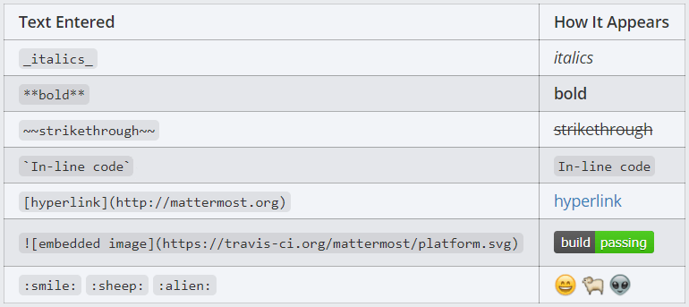

# 投稿

## 基本的な投稿の書式

Mattermostでは普通のメッセージをやり取りするだけでなく、Markdown記法によりメッセージを修飾することができます。
Markdown記法を利用することで、手軽にメッセージを分かりやすくすることができるため、積極的に利用しましょう。

### メッセージの修飾



上記の図は基本的なMarkdown記法です。
例えば、文字を`**`で囲むことにより **太字** として表示したり、`~~`で囲むことで ~~打ち消し線~~ を表現することができます。
また、``とすることにより画像をメッセージ内に埋め込むこともできるため、ビルドの結果をレッド/グリーンで示すなど、よりリッチな表現が可能となります。

### リスト

リスト書式については、箇条書きリスト、順序付きリスト、タスクリストを作成できます。
ただし、タスクリストについては、チェックボックスをクリックしてもチェックすることはできないため、ステータスを変更するにはメッセージを編集する必要があります。

### コードブロック

`` ` ``を3つで文章を囲むことでコードブロックと呼ばれる、Markdown書式を無視してテキストを書き込むことができます。

コードブロックの初めにプログラミング言語名を書くことでシンタックスハイライトした状態でソースコードをコメントすることができます。

プログラミング言語以外にもHTMLやYAMLなどもシンタックスハイライトすることができます。
使用可能なフォーマットについてはヘルプページを確認してください。

ユニークな機能として、シンタックスハイライトに`latex`を指定するとTex形式の数式を書くこともできます。

```latex
X_k = \sum_{n=0}^{2N-1} x_n \cos \left[\frac{\pi}{N} \left(n+\frac{1}{2}+\frac{N}{2}\right) \left(k+\frac{1}{2}\right) \right]
```

Mattermostで使用できるメッセージの書式については、ヘルプページから確認することができます。
https://${MattermostのURL}/help/formatting

## ファイル添付

Mattermost画面上にファイルをドラッグ＆ドロップすることでメッセージにファイルを添付することができます。
１メッセージにつき5つまでファイルを添付できます。

添付されたファイルはダウンロードボタンからダウンロードできるほか、画像やPDFファイルなどはサムネイルをクリックすることでダウンロードせずにプレビューを見ることができます。

### 公開リンクの共有

ファイルプレビューの画面の右下にある、`公開リンクを取得する`から公開リンクを取得することで、Mattermostにアカウントの無い方へもファイルを共有することができます。

## ハッシュタグ
TwitterやInstagraなどと同じように、Mattermostでも投稿に`#`で始まるハッシュタグを含めることができます。
ハッシュタグは自動でリンクとなり、そのリンクをクリックすると同じハッシュタグを持つ投稿を一覧することができます。

３文字以上からハッシュタグとして認識され、日本語のような２バイト文字でも同様に３文字以上でハッシュタグとして認識されます。(例: `#日本語`)

## フラグ
投稿のヘッダ部分に表示される旗のマークをクリックすることで、投稿にフラグを付けることができます。
フラグの付けられた投稿は、チャンネル上部のフラグマークから確認できます。

フラグの付けられた投稿はユーザーごとに管理され、他のユーザーからは見えないため、自分専用の投稿へのブックマークとして使用することができます。

## ピン留め
投稿の右上のメニューから`チャンネルにピン留めする`メニューを選択することにより、投稿をチャンネルにピン留めすることができます。
ピン留めされた投稿は各チャンネルごとに保存され、チャンネル上部のピンマークのメニューから確認できます。

フラグとは異なり、ピン留めされた投稿はチャンネルごとに管理され、ユーザー全員に共有されます。
チャンネルの投稿ルールなどを書いた投稿をピン留めするなど、新しく参加した人に知っておいて欲しいことなどをピン留めしておくと良いかと思います。
